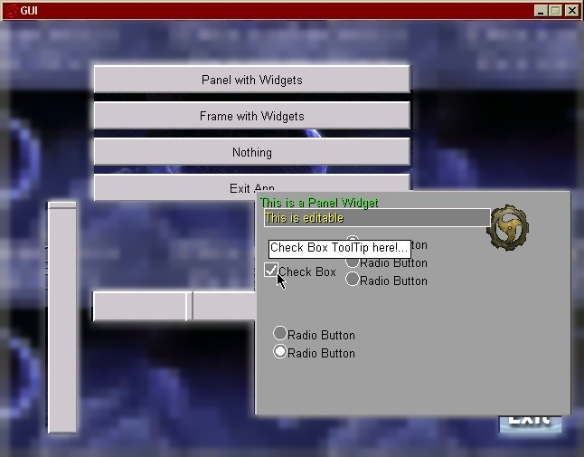
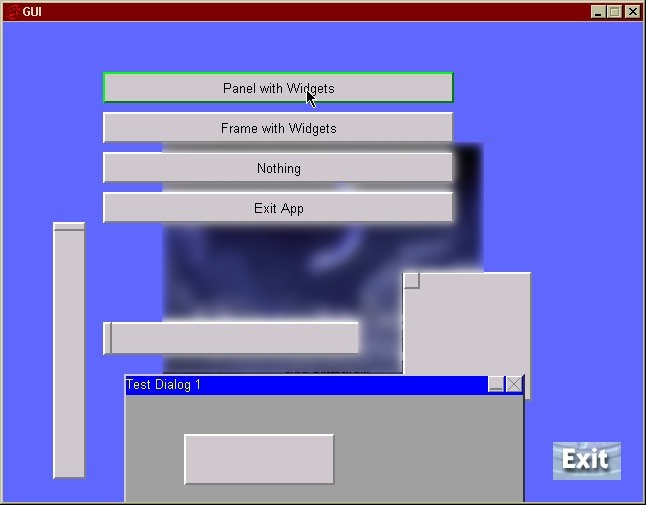

# Goblin (GuiOBjectLINk)  
  
This library was originally developed back in 2000 as an addon GUI library to the CDX library.  

# CDX  
CDX is a Game Development Kit written in C++ for DirectX along with a published book written by Bil Simser and Goblin was included.  

# Goblin Features
## Screenshots



## Feature List
- Simple Memory Management. All widgets should be added to the gui system using AddChild or AddInActiveChild. When the gui system is shutdown, it will automatically delete the memory allocated for all children activate and inactive. Only Active children are handled and to make a child active, call ActivateChild.

- Font handling system. 

```CDXFontGDI *font = NULL;   
font = new CDXFontGDI;   
font->Create( m_pScreen, "Times New Roman", 16);  
char fontidx = GM.AddFont(font);  

Widget.SetFontIndexToUse( fontidx );
```

- Colour system. GOBLIN has a table of predefined colours fast the base commonly used colours. And a table of defines for objects like, WindowBorderColor, ButtonFace, ButtonText, etc. Changing these colours will modify all objects that reference them. This is how to give your UI a theme.

- NO GDI graphics calls at all. GDI is used in CDXFontGDI for string stuff. 

- Sliders. Universal single slider class handles both vertical & horizontal slider bars. Also works as both at the same time for a 2d control.

- Background images. Center Image, Tile Image, Scrolling Tile Image (animated).

- Check Boxes and Radio Buttons are created by code. Good to use as a base, but recommend using sprites as end result for better performance.

- Push Buttons with rollover effect.

- Static Text object. Plain text object does nothing but display. Good for titles, etc. 

- Static Bitmap object. Great for logos and background images.

- Frame (dialog) window with dragable title bar with close & minimize box (child push buttons).

- Panel (same as frame without title bar). Draggable when clicked anywhere on panel.

- Tool tips on any object. (tooltip supported in base class of all objects)

- Desktop is an object derived from same base class, which allows same features to desktop as any other object.

- Every object is classified as a child or a parent. Only parents can have children. Ex: Menu contains buttons.

- Manager can have wallpaper or a fill colour.

- Menu object containing children. Menu background can be transparent so mouse events will pass through to desktop. Makes it simple to implement an overlay menu that is full screen and keep behind objects alive. 

- Popup Menu object handled in manager. Similar to popup window when right clicking on windows desktop. Auto-Resizing. Handles irregular sized menu items.
